# Form 686C-674 flow by chapter

Chapter: Veteran's Information
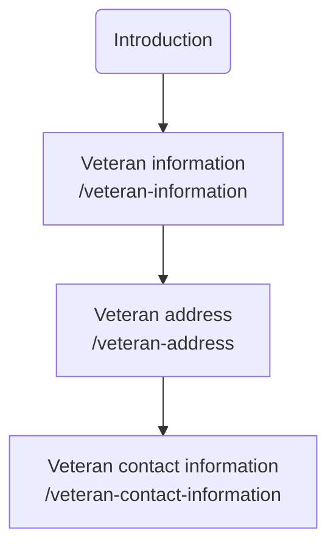

Chapter: Add or Remove Dependents / Manage Dependents
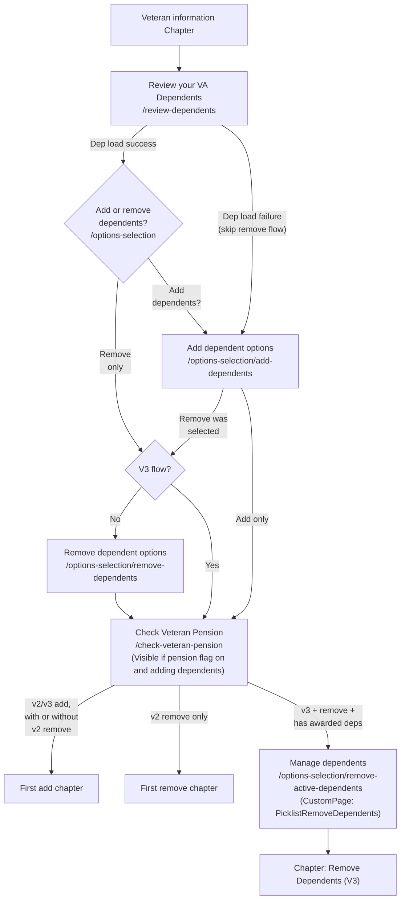

Chapter: Remove Dependents (V3)
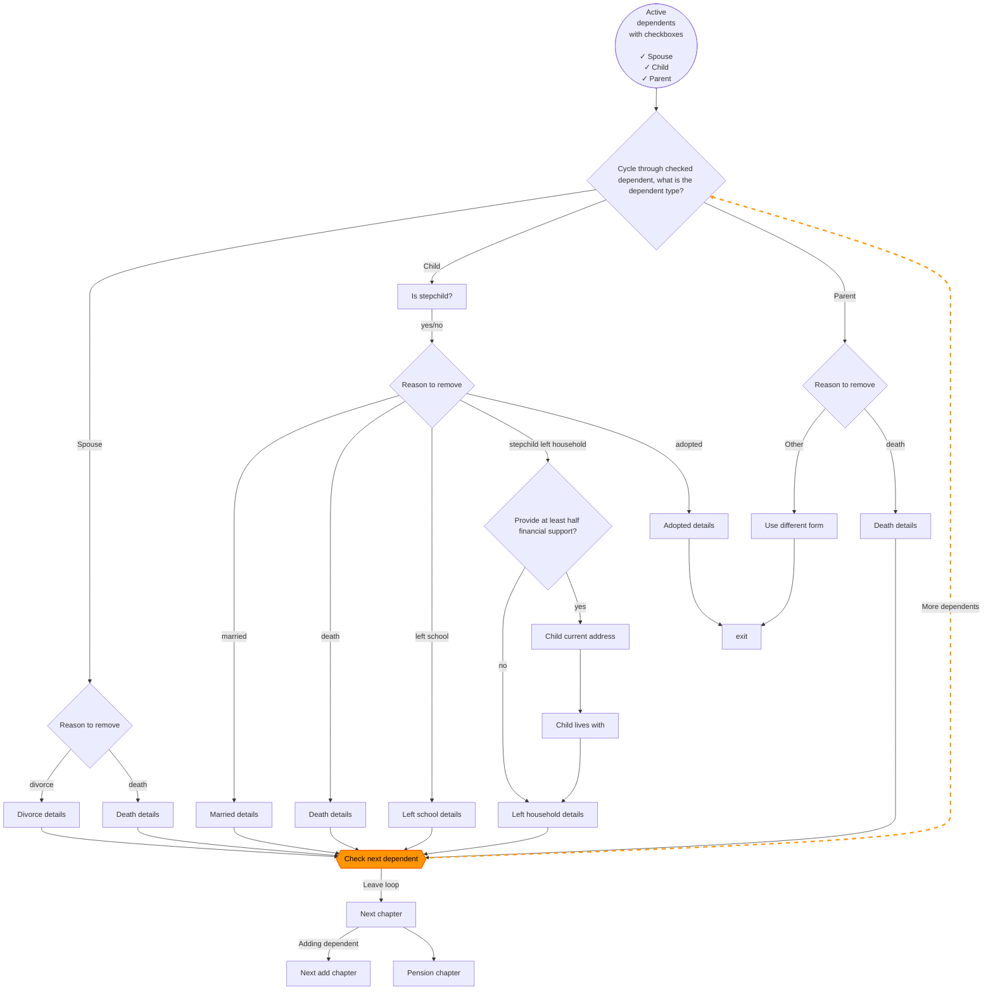

Chapter: Add Your Spouse
```mermaid
flowchart TD
  ADD_OPTS["Add dependents"] -->|"Add spouse"| SPOUSE_START

  SPOUSE_START["Current spouse's personal information<br/>/add-spouse/current-legal-name"]
  SPOUSE_ID["Current spouse's identification<br/>/add-spouse/personal-information"]
  SPOUSE_MIL{"Spouse is<br/>a veteran?"}
  SPOUSE_MIL_INFO["Spouse's military service<br/>/add-spouse/military-service-information"]
  SPOUSE_LIVE["Marriage information<br/>/current-marriage-information/living-together"]
  SPOUSE_LIVE_CHECK{"Spouse lives<br/>with veteran?"}
  SPOUSE_ADDR["Spouse's address<br/>/current-marriage-information/spouse-address"]
  SPOUSE_SEPARATE["Reason living separately<br/>/current-marriage-information/reason-for-living-separately"]
  SPOUSE_PENSION_CHECK{"Show pension<br/>related questions?"}
  SPOUSE_INCOME["Spouse's income<br/>/current-marriage-information/spouse-income"]
  SPOUSE_LOCATION["Marriage location<br/>/current-marriage-information/location-of-marriage"]
  SPOUSE_TYPE["Marriage type<br/>/current-marriage-information/type-of-marriage"]

  SPOUSE_START --> SPOUSE_ID
  SPOUSE_ID --> SPOUSE_MIL
  SPOUSE_MIL -->|"Yes"| SPOUSE_MIL_INFO --> SPOUSE_LIVE
  SPOUSE_MIL -->|"No"| SPOUSE_LIVE
  SPOUSE_LIVE --> SPOUSE_LIVE_CHECK
  SPOUSE_LIVE_CHECK -->|"Not living together"| SPOUSE_ADDR --> SPOUSE_SEPARATE --> SPOUSE_PENSION_CHECK
  SPOUSE_LIVE_CHECK -->|"Living together"| SPOUSE_PENSION_CHECK
  SPOUSE_PENSION_CHECK -->|"Pension flag<br/>toggle on"| SPOUSE_INCOME --> SPOUSE_LOCATION
  SPOUSE_PENSION_CHECK -->|"Pension flag<br/>toggle off"| SPOUSE_LOCATION
  SPOUSE_LOCATION --> SPOUSE_TYPE

  SPOUSE_TYPE --> SPOUSE_MARRIAGE_HIST["Spouse's marital history<br/>/current-spouse-marriage-history"]
  SPOUSE_MARRIAGE_HIST -.-> |"add"| EX_INFO["Spouse's history<br/>Name, How, When, Where"]
  EX_INFO -.-> EX_ADD{Add another}
  EX_ADD -.-> |"Yes"| EX_INFO
  EX_ADD --> |"No"| VET_MARRIAGE_HIST

  SPOUSE_MARRIAGE_HIST --> VET_MARRIAGE_HIST["Veteran's marital history<br/>/veteran-marriage-history"]
  
  VET_MARRIAGE_HIST -.-> |"add"| EX_INFO2["Veteran's history<br/>Name, How, When, Where"]
  EX_INFO2 -.-> EX_ADD2{Add another}
  EX_ADD2 -.-> |"Yes"| EX_INFO2
  EX_ADD2 --> |"No"| HOUSEHOLD_CHECK
  
  VET_MARRIAGE_HIST --> HOUSEHOLD_CHECK["Pension chapter"]
```

Chapter: Add One or More Children
```mermaid
flowchart TD
  ADD_OPTS["Add dependents"] -->|"Add a child or<br/>a disabled child"| CHILD_START

  CHILD_START["Add child intro<br/>/686-report-add-child<br/>(Array Builder)"]
  CHILD_SUMMARY{"Child summary + Add another?<br/>/686-report-add-child/summary"}
  CHILD_INFO["Child information<br/>/686-report-add-child/:index/information"]
  CHILD_BIRTH["Place of birth<br/>/686-report-add-child/:index/place-of-birth"]
  CHILD_REL["Relationship type<br/>/686-report-add-child/:index/relationship-to-child"]
  CHILD_STEP_CHECK{"Child is a<br/>stepchild?"}
  CHILD_STEP["Biological parents<br/>/686-report-add-child/:index/stepchild"]
  CHILD_DISABILITY["Child's disability<br/>/686-report-add-child/:index/disability-part-one"]
  CHILD_DIS_CHECK{"Has permanent<br/>disability?"}
  CHILD_DIS2["Disability details<br/>/686-report-add-child/:index/disability-part-two"]
  CHILD_ADDL["Additional info<br/>/686-report-add-child/:index/additional-information-part-one"]
  CHILD_MARRIED_CHECK{"Was ever<br/>married?"}
  CHILD_MARRIAGE_END["Marriage end details<br/>/686-report-add-child/:index/marriage-end-details"]
  CHILD_PENSION_CHECK{"Show pension<br/>related questions?"}
  CHILD_ADDL2["Additional info pt 2<br/>/686-report-add-child/:index/additional-information-part-two"]
  CHILD_LIVES_CHECK{"Lives with<br/>veteran?"}
  CHILD_ADDR1["Child's address<br/>/686-report-add-child/:index/child-address-part-one"]
  CHILD_ADDR2["Child's address pt 2<br/>/686-report-add-child/:index/child-address-part-two"]

  CHILD_START --> CHILD_INFO --> CHILD_BIRTH --> CHILD_REL
  CHILD_REL --> CHILD_STEP_CHECK
  CHILD_STEP_CHECK -->|"stepchild + not biological"| CHILD_STEP --> CHILD_DISABILITY
  CHILD_STEP_CHECK -->|"Not stepchild"| CHILD_DISABILITY
  CHILD_DISABILITY --> CHILD_DIS_CHECK
  CHILD_DIS_CHECK -->|"Yes"| CHILD_DIS2 --> CHILD_ADDL
  CHILD_DIS_CHECK -->|"No"| CHILD_ADDL
  CHILD_ADDL --> CHILD_MARRIED_CHECK
  CHILD_MARRIED_CHECK -->|"Yes"| CHILD_MARRIAGE_END --> CHILD_PENSION_CHECK
  CHILD_MARRIED_CHECK -->|"No"| CHILD_PENSION_CHECK
  CHILD_PENSION_CHECK -->|"Yes"| CHILD_ADDL2 --> CHILD_LIVES_CHECK
  CHILD_PENSION_CHECK -->|"No"| CHILD_LIVES_CHECK
  CHILD_LIVES_CHECK -->|"No"| CHILD_ADDR1 --> CHILD_ADDR2
  CHILD_ADDR2 --> CHILD_SUMMARY
  
  CHILD_SUMMARY -->|"No"| HOUSEHOLD_CHECK["Pension chapter"]
  CHILD_SUMMARY -->|"Yes"| CHILD_INFO
```

Chapter: Add Students (18-23) - Form 674
```mermaid
flowchart TD
  ADD_OPTS["Add dependents"] -->|"Add child under 18, or child with permanent disability"| CHILD_START

  CHILD_START["Add child intro<br/>/686-report-add-child<br/>(Array Builder)"]
  CHILD_SUMMARY{"Summary +<br/>Add another?<br/>/686-report-add-child/summary"}
  CHILD_INFO["Child name, DoB, and SSN<br/>/686-report-add-child/:index/information"]
  CHILD_BIRTH["Place of birth<br/>/686-report-add-child/:index/place-of-birth"]
  CHILD_REL["Relationship type<br/>/686-report-add-child/:index/relationship-to-child"]
  CHILD_STEP_CHECK{"Child is a<br/>stepchild?"}
  CHILD_STEP["Biological parents<br/>/686-report-add-child/:index/stepchild"]
  CHILD_DISABILITY["Child's disability<br/>/686-report-add-child/:index/disability-part-one"]
  CHILD_DIS_CHECK{"Has permanent<br/>disability?"}
  CHILD_DIS2["Disability details<br/>/686-report-add-child/:index/disability-part-two"]
  CHILD_ADDL["Child lives with you, or ever been married?<br/>/686-report-add-child/:index/additional-information-part-one"]
  CHILD_MARRIED_CHECK{"Was ever<br/>married?"}
  CHILD_MARRIAGE_END["Marriage end details<br/>/686-report-add-child/:index/marriage-end-details"]
  CHILD_PENSION_CHECK{"Show pension<br/>related questions?"}
  CHILD_ADDL2["Child income in<br/>past 365 days?<br/>/686-report-add-child/:index/additional-information-part-two"]
  CHILD_LIVES_CHECK{"Lives with<br/>veteran?"}
  CHILD_ADDR1["Child's address<br/>/686-report-add-child/:index/child-address-part-one"]
  CHILD_ADDR2["Child's lives with?<br/>/686-report-add-child/:index/child-address-part-two"]

  CHILD_START --> CHILD_INFO --> CHILD_BIRTH --> CHILD_REL
  CHILD_REL --> CHILD_STEP_CHECK
  CHILD_STEP_CHECK -->|"stepchild + not biological"| CHILD_STEP --> CHILD_DISABILITY
  CHILD_STEP_CHECK -->|"Not a stepchild"| CHILD_DISABILITY
  CHILD_DISABILITY --> CHILD_DIS_CHECK
  CHILD_DIS_CHECK -->|"Yes"| CHILD_DIS2 --> CHILD_ADDL
  CHILD_DIS_CHECK -->|"No"| CHILD_ADDL
  CHILD_ADDL --> CHILD_MARRIED_CHECK
  CHILD_MARRIED_CHECK -->|"Yes"| CHILD_MARRIAGE_END --> CHILD_PENSION_CHECK
  CHILD_MARRIED_CHECK -->|"No"| CHILD_PENSION_CHECK
  CHILD_PENSION_CHECK -->|"Pension flag<br/>toggle on"| CHILD_ADDL2 --> CHILD_LIVES_CHECK
  CHILD_PENSION_CHECK -->|"Pension flag<br/>toggle off"| CHILD_LIVES_CHECK
  CHILD_LIVES_CHECK -->|"No"| CHILD_ADDR1 --> CHILD_ADDR2
  CHILD_ADDR2 --> CHILD_SUMMARY

  CHILD_SUMMARY -->|"No"| HOUSEHOLD_CHECK["Pension chapter"]
  CHILD_LIVES_CHECK -->|"Yes"| CHILD_SUMMARY
  CHILD_SUMMARY -->|"Yes"| CHILD_INFO
```

Chapter: Report Divorce (V2 only)
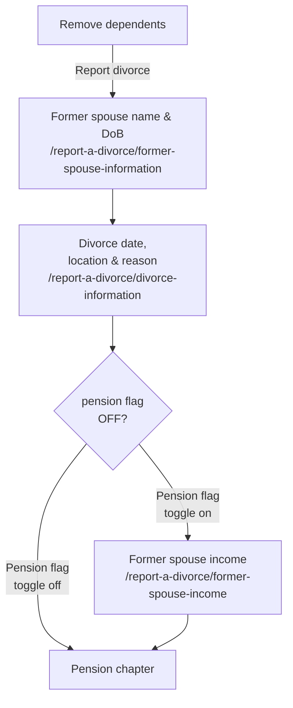

Chapter: Stepchild Left Household (V2 only)
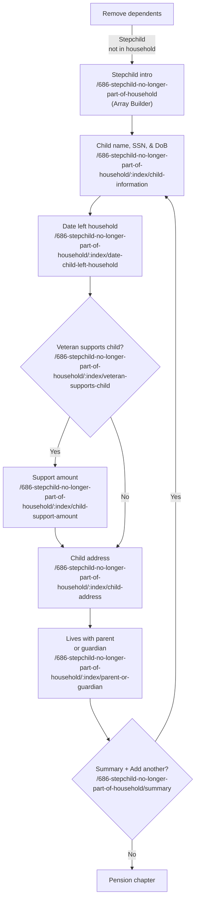

Chapter: Deceased Dependents (V2 only)
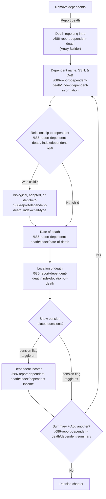

Chapter: Child Marriage (V2 only)
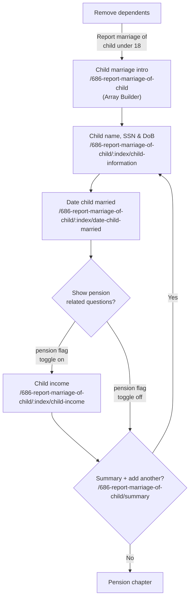

Chapter: Child Left School (V2 only)
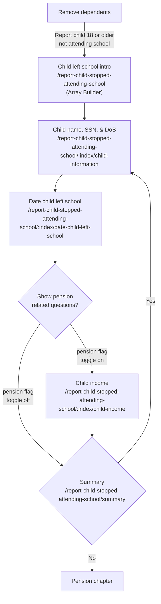

Chapter: Pension (Your Net Worth)
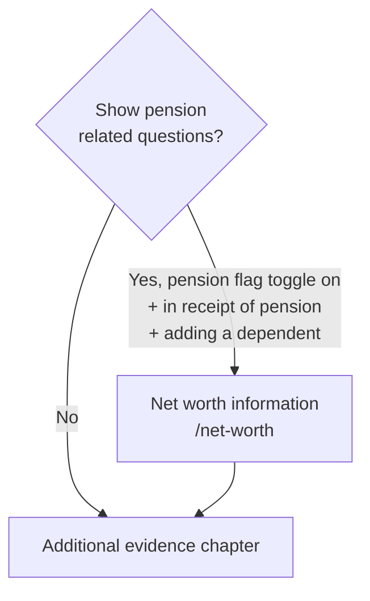

Chapter: Additional Information
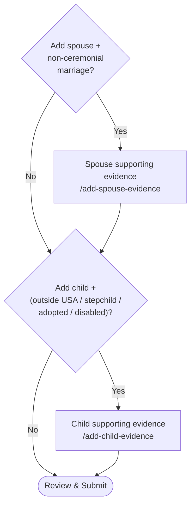
