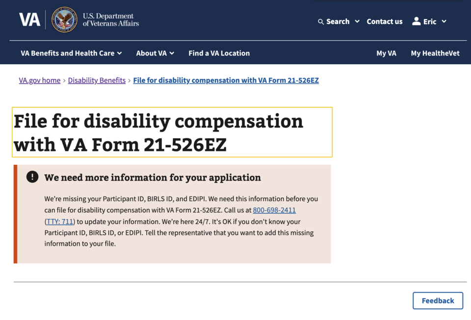
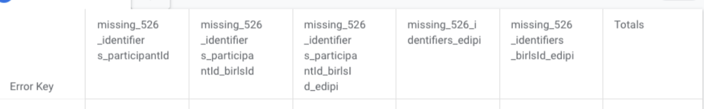
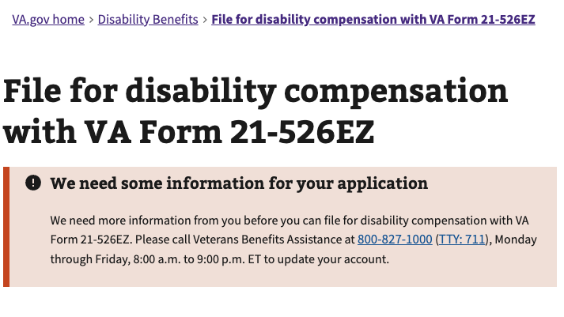

# Required ID's Investigation - Technical Project Documentation

| Area                          | Description                                                                            |
| ----------------------------- | -------------------------------------------------------------------------------------- |
| **Project Goal**              | Determine which ID's are truly required in order to start Form 21-526EZ.               |
| **Super Epic**                | [#125577](https://github.com/department-of-veterans-affairs/va.gov-team/issues/125577) |
| **Current State of Document** | In Progress                                                                            |
| **Stakeholders**              | Daniel Vu, Oren Mittman, Eryn Sobing                                                   |
| **Assigned Team**             | Team 5                                                                                 |

# **High Level Overview**

VA Form 21-526EZ allows veterans to apply for disability compensation through VA.gov. The form is active in the production
environment and continues to receive updates.

The Benefits Delivery at Discharge program (“BDD”) allows veterans to apply for compensation benefits 180 to 90 days
before discharge and allows for an expedited adjudication process. In addition to the timeframe condition, the veteran
is expected to include a Separation Health Assessment (“SHA”, commonly referred to as “SHA Part A”) as part of their claim. 

The VA would like to move all submissions of the SHA from paper to the online experience as part of a policy mandate. As
part of this, we'd like to understand what are blockers to the frontdoor. The work here is to investigate an existing
behavior / functionality that users see when they do not have certain ID's, which blocks their ability to even start
Form 21-526EZ.

# **Key Takeaways**

After reading the Foundational Knowledge section, you should be equipped with these take-aways.

1. There are two Alerts: one for Missing Identifiers and one for Missing Services.
1. The Missing Identifiers Alert can appear if any of the following are missing: BIRLS ID, EDIPI, Participant ID, SSN, or Birth Date.
1. If the ICN, EDIPI, and SSN are all available, but either BIRLS or Participant ID are missing, an "add-person" proxy
   endpoint is called to tell MPI to create both of those ID's.
1. If the add-person proxy call succeeds, there is still a bug where the veteran will not see the success until they
   refresh the page. **Action Item:** Plan to fix bug.
1. If the add-person proxy call fails, the Missing Services alert appears.
1. The add-person proxy call can fail in the backend if the BIRLS ID is missing but Participant ID is present, which
   contrasts with the requirement codified in the front supporting either or being missing.
1. Reflected in the above point, both vets-website and vets-api have a "smattering" of code that is either dead or
   reflects discrepancies in the business logic. It would be ideal to dedicate time to centralizing the requirements
   into one cohesive approach. **Action Item:** Plan refactor of Alert approach.
1. Given current the current state of our monitoring, it isn't possible to track how many of these alerts impact
   BDD-qualifying veterans. **Action Item:** Enhance monitoring.

# **Foundational Knowledge**

After completing the initial Form 526 wizard, the veteran may be present with this alert if the system does not have
enough inforomation about the veteran.



The acrnonyms can be found in the [Glossary/Acronym section](#glossary--acronyms).

Some information about these specific identifiers:

| Acronym | Name                                                          | Source of ID | Notes                                                                                                                                                                                                                                                                                                                                                                                                                                                                                           |
| ------- | ------------------------------------------------------------- | ------------ | ----------------------------------------------------------------------------------------------------------------------------------------------------------------------------------------------------------------------------------------------------------------------------------------------------------------------------------------------------------------------------------------------------------------------------------------------------------------------------------------------- |
| PID     | "Participant ID"                                              | VBA - CorpDB | This identifies everyone, not just veterans but also dependents, employees, service officers, etc. It's the universal person key within VBA systems. A Veteran cannot have multiple PID's; if they do, the system will block the login attempt.                                                                                                                                                                                                                                                 |
| BIRLS   | "Beneficiary Identification and Records Locator (Sub)System". | MPI          | Legacy beneficiary record locator; BIRLS pre-dates CorpDB. Contains Veteran information from DoD systems, other VA systems to include Military history, insurance information, person information, etc. A veteran can have multiple BIRLS id's; on form submission failures, the system cycles through alternate BIRLS' ids.                                                                                                                                                                    |
| EDIPI   | "Electronic Data Interchange Personal Identifier"             | DoD - DEERS  | It's the military's unique identifier for service members, veterans, and other DoD-affiliated personnel. The EDIPI is intended to replace Social Security numbers for DoD business purposes and is printed on the back of the DoD "common access card" (CAC) identification cards. Not every veteran is guaranteed to have an EDIPI, particularly those whose service predates modern DoD systems. A Veteran cannot have multiple EDIPI's; if they do, the system will block the login attempt. |
| ICN     | "Integration Control Number"                                  | VHA - MPI    | This is basically the "master" cross-system correlation key. If the ICN has been set, we know the user is a real, verified human. Technically ICN's can have different statuses (P for Permanent, H for deprecated eu to merge, D for deprecated due to duplicate, etc) and are not guaranteed to be stable long-term. The ICN is considered PII and should not be used for logging.                                                                                                            |
| SECID   | eAuth Security Identifier                                     | VA - MPI     | A persistent UUI assigned by the VA's Identity and Access Management system and is stored in MPI. Stable id used to correlation against different credential service providers like ID.me, Login.gov, etc. Only identity-verified accounts will have a SEC ID. A user can have multiple SEC ID's but it can cause issues with ICN correlation.                                                                                                                                                  |

---

When the veteran logs into VA.gov, a call to `/v0/user` is made. In there, there is a property called `data.attributes.profile.claims.form526RequiredIdentifierPresence`
that outlines which identifiers and profile data are available.

The OpenAPI doc for `/v0/user` can be found [here](https://department-of-veterans-affairs.github.io/va-digital-services-platform-docs/api-reference/#/user).

Here is an example using vets.gov.user+3@gmail.com from staging.

```json
// GET /v0/user
// Extra information excluded to improve readability
{
  "data": {
    "id": "",
    "type": "user",
    "attributes": {
      "profile": {
        "claims": {
          "form526RequiredIdentifierPresence": {
            "participantId": false,
            "birlsId": false,
            "ssn": true,
            "birthDate": true,
            "edipi": false
          }
        },
        "icn": "1013144622V807216",
        "npiId": null,
        "birlsId": null,
        "edipi": null,
        "secId": "1013144622"
      }
    }
  }
}
```

If any property under `form526RequiredIdentifierPresence` is false, [it will cause the "Missing Identifier" alert to show](https://github.com/department-of-veterans-affairs/vets-website/blob/37ff7d9667fe83c43cbd124272a805b99484b970/src/applications/disability-benefits/all-claims/Form526EZApp.jsx#L341-L353).
In addition to showing this alert, a Google Analytics event is emitted with `event` set to "visible-alert-box" and
[`error-key` set to a string prefixed with "missing_526_identifiers\_" followed by the array of missing identifiers joined](https://github.com/department-of-veterans-affairs/vets-website/blob/a386f91a113eb60344eaa9fa5a5722a799b01bac/src/applications/disability-benefits/all-claims/containers/Missing526Identifiers.jsx#L83).



## Missing BIRLS / Participant ID Auto Recovery

There are legitimate reasons that these identifiers might not exist. A veteran who served, separated, and never filed
any VA benefit claim or pension would have no reason to exist in BIRLS. They may have an EDIPI (from DoD, although they
may not have one if their service predates the DEERS system) and potentially an ICN (from MPI if they've used any VA
service), but no BIRLS record.

When the veteran **has an ICN, EDIPI, and SSN on file**, but no BIRLS id and/or no participant id, there is potential for the system to "auto-recover" by generating a BIRLS id for
the veteran at that time. In this scenario, vets-api may add a "add-person" designation to the `profile.services`
array in `/v0/user`. After that, [vets-website will interpret this](https://github.com/department-of-veterans-affairs/vets-website/blob/37ff7d9667fe83c43cbd124272a805b99484b970/src/applications/disability-benefits/all-claims/Form526EZApp.jsx#L330-L337) as meaning it is ok to try to make an API call to make
the BIRLS ID and their CorpDB ID using the add-person proxy. This [proxy is a call](https://github.com/department-of-veterans-affairs/vets-website/blob/37ff7d9667fe83c43cbd124272a805b99484b970/src/applications/disability-benefits/all-claims/actions/index.js#L56-L61) to `/mvi_user/21-0966`.

The OpenAPI doc for `/mvi_user/21-0966` can be found [here](https://department-of-veterans-affairs.github.io/va-digital-services-platform-docs/api-reference/#/form_526/postMviUser).

Once this call is successful, a BIRLS id should be available and the veteran should be able to proceed with starting
Form 21-526EZ.

There is currently a bug in the frontend that was discovered by Oren Mittman where the frontend react to the proxy call
correctly. In a video attached to his [investigation](https://github.com/department-of-veterans-affairs/va.gov-team/issues/131536#issuecomment-4083724066)
, he demonstrates that while the call was successful, the page continues to show the error. Upon refresh of the page,
the veteran no longer sees the error and is able to start Form 21-526EZ.

## Missing Services Alert

There is a similar but different alert that shows when the veteran is missing a "service".



When the `/v0/user` endpoint is called, the response has a property `profile.services`, which is an array of strings.
When this array does contain "form526", this alert will appear.

This alert emits a Google Analytics event with an error-key of "missing_526_or_original_claims_service".

The Missing Identifier alert mentioned before supercedes this alert; if conditions are met for the Missing Identifier,
this Missing Services alert will not show. The condition for the Missing Service alert can be found [here](https://github.com/department-of-veterans-affairs/vets-api/blob/f1004b6532cc9be0cbc76e5f3cc956abbd82244d/app/policies/evss_policy.rb#L21-L28). It checks for the presence
of...

- EDIPI
- SSN
- BIRLS ID
- Participant ID
- Birth Date

We can see that this is the same information that is checked by the Missing Identifier alert and looking through the
comments, this Missing Services Alert should be ["deprecated in favor of the Missing Identifier Alert"](https://github.com/department-of-veterans-affairs/vets-website/blob/643191bcf471fa2cb3b0fd37517b28ff3e509545/src/applications/disability-benefits/all-claims/Form526EZApp.jsx#L366).

However, in Google Analytics, we see that this deprecated alert still appears. The reason is because it is actually used
as the [fallback message when the add-person proxy auto-recovery fails](https://github.com/department-of-veterans-affairs/vets-website/blob/643191bcf471fa2cb3b0fd37517b28ff3e509545/src/applications/disability-benefits/all-claims/containers/AddPerson.jsx#L35-L36).

There is some other [code that shows this alert](https://github.com/department-of-veterans-affairs/vets-website/blob/41b44d0c709d076137ffbbbfa059a34ec733eafb/src/applications/disability-benefits/all-claims/Form526EZApp.jsx#L367-L369).
However, this code is effectively "dead code". It is unreachable and it would be best to remove this as part of
technical cleanup.

## Missing BIRLS ID but Participant ID Present

If the BIRLS ID is missing but a Participant ID is present, the add-person proxy (`/v0/mvi_user/{form_id}`) actually
throws an error with message "No birls_id while participant_id present". So even though the frontend is calling this
endpoint to recover, the backend errors out quickly and prevents further action. This leads to the "Missing Services"
alert. Based on the existing information in the respone of `/v0/user`, we should be able to only call the add-person
proxy if needed, but server-validation is good to have as well.

## Regarding "BDD"

A lot of this investigation was initiated because of a recent policy mandata that would move more veterans from the paper
form to the digital form as part of the "Benefits Delivery at Discharge" program. The interest revolves around ensuring
veterans can "enter the frontdoor".

Unfortunately, given the current state of our instrumentation, there is no good way to segment the BDD from Non-BDD
qualifying submissions for these errors. We can work future initiatives to improve this monitoring.

# **Glossary / Acronyms**

| Term  | Definition                                                                                                                                                                                                                                                                               |
| ----- | ---------------------------------------------------------------------------------------------------------------------------------------------------------------------------------------------------------------------------------------------------------------------------------------- |
| BIRLS | "Beneficiary Identification and Records Locator (Sub)System". Legacy application that is viewed through the SHARE GUI. Contains Veteran information from DoD systems, other VA systems to include Military history, insurance information, person information, etc                       |
| MPI   | "Master Person Index".                                                                                                                                                                                                                                                                   |
| EDIPI | "Electronic Data Interchange Personal Identifier". It is a unique ID assigned by the Department of Defense (DoD) and originates from the DEERS (Defense Enrollment Eligibility Reporting System) database. It's historically associated with DS Logon as a credential-linked identifier. |
| DEERS | "Defense Enrollment Eligibility Reporting System".                                                                                                                                                                                                                                       |

# **References**

- [Form 21-526EZ](https://www.va.gov/disability/file-disability-claim-form-21-526ez/introduction)
- [Original Investigation](https://github.com/department-of-veterans-affairs/va.gov-team/issues/131536)

# **Appendix**

## Note from Jacob Worrell

[Original thread](https://dsva.slack.com/archives/C055573C508/p1757610067562639?thread_ts=1757603814.001759&cid=C055573C508)

Why a Veteran Might Not Get Provisioned Each ID

1. Electronic Data Interchange Personal Identifier (EDIPI)
   Reasons they might have it:
   All post-1980s service members are entered into the Defense Enrollment Eligibility Reporting System (DEERS) at accession (swearing an enlistment oath, taking a commission)

Reasons they might not:
Separated before DEERS was implemented (early 1980s).
Data mismatch (wrong Social Security Number, name change, or bad data load) prevented correct assignment.
Never enrolled in DEERS properly due to edge cases at accession or separation.

2. Beneficiary Identification and Records Locator Subsystem (BIRLS) ID
   Reasons they might have it:
   VBA Records Management Centers (RMCs) historically created one when Service Treatment Records (STRs) were sent to VA at separation.
   This still happens for Coast Guard, Public Health Service, and National Oceanic and Atmospheric Administration separations.
   A Regional Office created one when establishing a claim folder using the “BIRLS Add” process in Share.

Reasons they might not:
For most separations after 2014, Service Treatment Records (STRs) were sent to the Department of Defense’s Healthcare Artifacts and Images Management Solution (HAIMS) instead of RMC, so no automatic BIRLS record was created.
The Veteran has never filed a claim, so no BIRLS record exists.
Technical mismatch (for example, STRs sent but no corresponding claims folder, or bad data prevented matching).

3. Participant ID (VBA Corporate Database person key)
   Reasons they might have it:
   Created the first time the Veteran is entered into VBA Corporate Database (CorpDB), usually when a claim is established in Veterans Benefits Management System (VBMS).
   Sometimes created manually by call center staff if a Veteran calls with an issue.

Reasons they might not:
The Veteran has never filed a claim.
A claim was started digitally but blocked before VBA Corporate Database could generate the Participant ID.
Identity mismatch between VA Master Veteran Index (MVI) and VBA Corporate Database prevented creation.

4. Integration Control Number (ICN)
   Reasons they might have it:
   Created when the person completes Level of Assurance 3 (LOA3) identity proofing via login.gov or ID.me.
   Even non-Veterans (like spouses or caregivers) can get one when they identity-proof through VA.gov.

Reasons they might not:
They never identity-proofed at LOA3 (for example, only browsing VA.gov anonymously).
Rarely, a technical mismatch in Master Veteran Index (MVI) prevented ICN creation.

Combinations — Why a Veteran Might Have Some but Not All
ICN only (but no BIRLS or Participant ID):
 First-time filer, identity-proofed through login.gov or ID.me, but has never filed a claim.
EDIPI + ICN (but no BIRLS or Participant ID):
 Typical modern first-time filer — Department of Defense created EDIPI at accession, VA created ICN at identity proofing, but VBA has not yet created their benefit system records.
BIRLS ID + Participant ID but no EDIPI:
 More common in older Veterans — especially pre-1980s separations — where VBA created records but DEERS never had them.
None of the above:
Someone who is not a Veteran (caregiver, family member, attorney, accredited representative).
A Veteran who has never been identity-proofed, never filed a claim, and whose Service Treatment Records (STRs) were never sent to VA.
