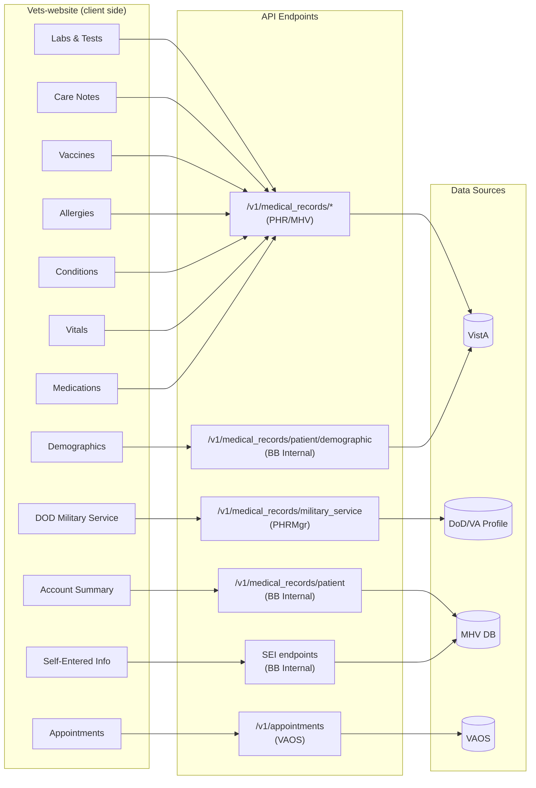

# MHV Blue Button Report — V1 Upstream Endpoint Reference

> **Last updated:** 2026-03-26
>
> This document catalogs every upstream MHV API endpoint used by the **V1** Blue Button report
> generation code on VA.gov. The primary implementation lives in the
> [`BBInternal::Client`](https://github.com/department-of-veterans-affairs/vets-api/blob/9f9d2e81fc3f72808565ee83ca723787f6b2c9f0/lib/medical_records/bb_internal/client.rb)
> class in the **department-of-veterans-affairs/vets-api** repository.

---

## Table of Contents

- [Overview](#overview)
- [Architecture](#architecture)
- [Source Repositories](#source-repositories)
- [Endpoint Inventory](#endpoint-inventory)
  - [Session / Authentication](#session--authentication)
  - [User Management](#user-management)
  - [PHR Medical Records (FHIR)](#phr-medical-records-fhir)
  - [Oracle Health Data Path](#oracle-health-data-path)
  - [Demographics & Military Service](#demographics--military-service)
  - [Radiology / Medical Imaging (BBMI)](#radiology--medical-imaging-bbmi)
  - [CCD (Continuity of Care Document)](#ccd-continuity-of-care-document)
  - [Health Record Sharing (Opt-in/Opt-out)](#health-record-sharing-opt-inopt-out)
  - [Self-Entered Information (SEI)](#self-entered-information-sei)
- [Full V1 Endpoint-to-Controller Mapping](#full-v1-endpoint-to-controller-mapping)
- [Data Flow Diagram](#data-flow-diagram)
- [Notes & Caveats](#notes--caveats)

---

## Overview

Blue Button (BB) for VHA is a feature that allows veterans to download a customizable summary of
their personal health information. Veterans can pick a date range and choose which categories to
include. The report aggregates data from multiple upstream systems — VistA (via PHR/FHIR APIs),
MHV's own database (self-entered data, account info), DoD/VA Profile (military service), and VAOS
(appointments).

The V1 implementation uses two MHV API gateway base paths, configured in `vets-api` settings:

| Constant             | Setting path                               | Purpose                     |
| -------------------- | ------------------------------------------ | --------------------------- |
| `USERMGMT_BASE_PATH` | `Settings.mhv.api_gateway.hosts.usermgmt`  | User management & auth APIs |
| `BLUEBUTTON_BASE_PATH` | `Settings.mhv.api_gateway.hosts.bluebutton` | Blue Button & SEI data APIs |

---

## Architecture

---

## Source Repositories

| Repository | Path / File | Role |
| --- | --- | --- |
| [department-of-veterans-affairs/vets-api](https://github.com/department-of-veterans-affairs/vets-api) | `lib/medical_records/bb_internal/client.rb` | Backend Ruby client — all upstream HTTP calls |
| [department-of-veterans-affairs/vets-website](https://github.com/department-of-veterans-affairs/vets-website) | `src/applications/mhv-medical-records/util/txtHelpers/blueButton.js` | Frontend TXT report generator |
| [department-of-veterans-affairs/vets-website](https://github.com/department-of-veterans-affairs/vets-website) | `src/applications/mhv-medical-records/util/pdfHelpers/blueButton.js` | Frontend PDF report generator |
| [department-of-veterans-affairs/va.gov-team](https://github.com/department-of-veterans-affairs/va.gov-team) | `products/health-care/medical-records/va-blue-button/engineering/` | Architecture docs & diagrams |
| [department-of-veterans-affairs/va.gov-team-sensitive](https://github.com/department-of-veterans-affairs/va.gov-team-sensitive) | `teams/mr/mhv-vets-api-mr-endpoint-mapping.md` | Authoritative endpoint mapping table |
| [department-of-veterans-affairs/mhv-np-bluebutton-api](https://github.com/department-of-veterans-affairs/mhv-np-bluebutton-api) | (root) | Legacy MHV Blue Button API (Java) |

---

## Endpoint Inventory

All paths below are relative to their respective MHV API gateway base URLs.

### Session / Authentication

| Method | Upstream Endpoint | Purpose | Client Method |
| --- | --- | --- | --- |
| GET | `/v1/usermgmt/auth/session` | Obtain an MHV session token | `get_session_tagged` |

### User Management

| Method | Upstream Endpoint | Purpose | Client Method |
| --- | --- | --- | --- |
| GET | `/v1/usermgmt/patient/uid/{userId}` | Patient info / Account Summary | `get_patient` |
| GET | `/v1/usermgmt/notification/bbmi` | BBMI notification setting | `get_bbmi_notification_setting` |
| GET | `/v1/usermgmt/emergencycontacts/{userId}` | Self-entered emergency contacts | `get_sei_emergency_contacts` |

### PHR Medical Records (FHIR)

| Method | Upstream Endpoint | Purpose | Controller |
| --- | --- | --- | --- |
| GET | `/v1/fhir/AllergyIntolerance` | List allergies | `V1::AllergiesController#index` |
| GET | `/v1/fhir/AllergyIntolerance/{id}` | Single allergy | `V1::AllergiesController#show` |
| GET | `/v1/fhir/Immunization` | List vaccines | `V1::VaccinesController#index` |
| GET | `/v1/fhir/Immunization/{id}` | Single vaccine | `V1::VaccinesController#show` |
| GET | `/v1/fhir/Immunization` | Vaccines PDF | `V1::VaccinesController#pdf` |
| GET | `/v1/fhir/Observation` | List vitals | `V1::VitalsController#index` |
| GET | `/v1/fhir/Condition` | List conditions (problem list) | `V1::ConditionsController#index` |
| GET | `/v1/fhir/Condition/{id}` | Single condition | `V1::ConditionsController#show` |
| GET | `/v1/fhir/DocumentReference` | List clinical notes | `V1::ClinicalNotesController#index` |
| GET | `/v1/fhir/DocumentReference/{id}` | Single clinical note | `V1::ClinicalNotesController#show` |
| GET | `/v1/fhir/DiagnosticReport` | List labs & tests | `V1::LabsAndTestsController#index` |
| GET | `/v1/fhir/DiagnosticReport/{id}` | Single lab/test | `V1::LabsAndTestsController#show` |

### Oracle Health Data Path

These are V1 endpoints that use an alternate upstream when `use_oh_data_path=1` is set (for Oracle Health / Cerner users):

| Method | Upstream Endpoint | Purpose | Controller |
| --- | --- | --- | --- |
| GET | `/services/fhir/v0/r4/AllergyIntolerance` | Allergies (OH users) | `V1::AllergiesController#index` |
| GET | `/services/fhir/v0/r4/Observation` | Vitals (OH users) | `V1::VitalsController#index` |

### Demographics & Military Service

| Method | Upstream Endpoint | Purpose | Client Method / Controller |
| --- | --- | --- | --- |
| GET | `/v1/bluebutton/external/phrdemographic` | VA demographics | `get_demographic_info` / `V1::MedicalRecords::PatientController#demographic` |
| GET | `/v2/phrmgr/dod/vaprofile/{edipi}` | DoD military service info | `V1::MedicalRecords::MilitaryServiceController#index` |
| GET | `/v2/phrmgr/status/{icn}` | PHR refresh status | `V1::MedicalRecords::MrSessionController#status` |

### Radiology / Medical Imaging (BBMI)

| Method | Upstream Endpoint | Purpose | Client Method |
| --- | --- | --- | --- |
| GET | `/v1/bluebutton/radiology/phrList/{patientId}` | Radiology reports (VIA) | `list_radiology` |
| GET | `/v1/bluebutton/study/{patientId}` | Imaging studies list (CVIX) | `list_imaging_studies` |
| GET | `/v1/bluebutton/studyjob/{patientId}/icn/{icn}/studyid/{studyIdUrn}` | Request study download from CVIX | `request_study` |
| GET | `/v1/bluebutton/studyjob/{patientId}` | Study job status | `get_study_status` |
| GET | `/v1/bluebutton/studyjob/zip/preview/list/{patientId}/studyidUrn/{studyIdUrn}` | Image list for a study | `list_images` |
| GET | `/v1/bluebutton/external/studyjob/image/studyidUrn/{studyIdUrn}/series/{series}/image/{image}` | Single image (JPG stream) | `get_image` |
| GET | `/v1/bluebutton/studyjob/zip/stream/{patientId}/studyidUrn/{studyIdUrn}` | DICOM zip stream | `get_dicom` |

### CCD (Continuity of Care Document)

| Method | Upstream Endpoint | Purpose | Client Method |
| --- | --- | --- | --- |
| GET | `/v1/bluebutton/healthsummary/{icn}/{lastName}/xml` | Generate CCD | `get_generate_ccd` |
| GET | `/v1/bluebutton/healthsummary/{date}/fileFormat/{FMT}/ccdType/{FMT}` | Download CCD (XML, HTML, or PDF) | `get_download_ccd` |

### Health Record Sharing (Opt-in/Opt-out)

| Method | Upstream Endpoint | Purpose | Controller |
| --- | --- | --- | --- |
| POST | `/v1/bluebutton/external/optinout/optin` | Opt in to health record sharing | `V1::HealthRecordsController#optin` |
| POST | `/v1/bluebutton/external/optinout/optout` | Opt out of health record sharing | `V1::HealthRecordsController#optout` |
| GET | `/v1/bluebutton/external/optinout/status` | Check sharing status | `V1::HealthRecordsController#status` |

### Self-Entered Information (SEI)

All SEI endpoints are called in parallel by `get_all_sei_data` when the user requests their full self-entered information. Each can also be called individually.

| Method | Upstream Endpoint | Purpose | Client Method |
| --- | --- | --- | --- |
| GET | `/v1/vitals/summary/{userId}` | Self-entered vitals | `get_sei_vital_signs_summary` |
| GET | `/v1/healthhistory/allergy/{userId}` | Self-entered allergies | `get_sei_allergies` |
| GET | `/v1/healthhistory/healthHistory/{userId}` | Self-entered family health history | `get_sei_family_health_history` |
| GET | `/v1/healthhistory/immunization/{userId}` | Self-entered immunizations | `get_sei_immunizations` |
| GET | `/v1/healthhistory/testEntry/{userId}` | Self-entered labs & tests | `get_sei_test_entries` |
| GET | `/v1/healthhistory/medicalEvent/{userId}` | Self-entered medical events | `get_sei_medical_events` |
| GET | `/v1/healthhistory/militaryHistory/{userId}` | Self-entered military history | `get_sei_military_history` |
| GET | `/v1/getcare/healthCareProvider/{userId}` | Self-entered healthcare providers | `get_sei_healthcare_providers` |
| GET | `/v1/getcare/healthInsurance/{userId}` | Self-entered health insurance | `get_sei_health_insurance` |
| GET | `/v1/getcare/treatmentFacility/{userId}` | Self-entered treatment facilities | `get_sei_treatment_facilities` |
| GET | `/v1/journal/journals/{userId}` | Self-entered food journal | `get_sei_food_journal` |
| GET | `/v1/journal/activityjournals/{userId}` | Self-entered activity journal | `get_sei_activity_journal` |
| GET | `/v1/pharmacy/medications/{userId}` | Self-entered medications | `get_sei_medications` |

---

## Full V1 Endpoint-to-Controller Mapping

| Controller#Action | vets-api Endpoint | Upstream API |
| --- | --- | --- |
| `V1::AllergiesController#index` | GET `/allergies` | GET `/v1/fhir/AllergyIntolerance` |
| `V1::AllergiesController#show` | GET `/allergies/:id` | GET `/v1/fhir/AllergyIntolerance/{id}` |
| `V1::AllergiesController#index` | GET `/allergies?use_oh_data_path=1` | GET `/services/fhir/v0/r4/AllergyIntolerance` |
| `V1::VaccinesController#index` | GET `/vaccines` | GET `/v1/fhir/Immunization` |
| `V1::VaccinesController#show` | GET `/vaccines/:id` | GET `/v1/fhir/Immunization/{id}` |
| `V1::VaccinesController#pdf` | GET `/vaccines/pdf` | GET `/v1/fhir/Immunization` |
| `V1::VitalsController#index` | GET `/vitals` | GET `/v1/fhir/Observation` |
| `V1::VitalsController#index` | GET `/vitals?use_oh_data_path=1` | GET `/services/fhir/v0/r4/Observation` |
| `V1::ConditionsController#index` | GET `/conditions` | GET `/v1/fhir/Condition` |
| `V1::ConditionsController#show` | GET `/conditions/:id` | GET `/v1/fhir/Condition/{id}` |
| `V1::ClinicalNotesController#index` | GET `/clinical_notes` | GET `/v1/fhir/DocumentReference` |
| `V1::ClinicalNotesController#show` | GET `/clinical_notes/:id` | GET `/v1/fhir/DocumentReference/{id}` |
| `V1::LabsAndTestsController#index` | GET `/labs_and_tests` | GET `/v1/fhir/DiagnosticReport` |
| `V1::LabsAndTestsController#show` | GET `/labs_and_tests/:id` | GET `/v1/fhir/DiagnosticReport/{id}` |
| `V1::MedicalRecords::MrSessionController#create` | POST `/session` | *(Initializes FHIR client session)* |
| `V1::MedicalRecords::MrSessionController#status` | GET `/session/status` | GET `/v2/phrmgr/status/{icn}` |
| `V1::MedicalRecords::CcdController#generate` | GET `/ccd/generate` | GET `/v1/bluebutton/healthsummary/{icn}/{lastName}/xml` |
| `V1::MedicalRecords::CcdController#download` | GET `/ccd/download` | GET `/v1/bluebutton/healthsummary/{date}/fileFormat/{FMT}/ccdType/{FMT}` |
| `V1::MedicalRecords::ImagingController#index` | GET `/imaging` | GET `/v1/bluebutton/study/{patientId}` |
| `V1::MedicalRecords::ImagingController#request_download` | GET `/imaging/:id/request` | GET `/v1/bluebutton/studyjob/{patientId}/icn/{icn}/studyid/{studyIdUrn}` |
| `V1::MedicalRecords::ImagingController#request_status` | GET `/imaging/status` | GET `/v1/bluebutton/studyjob/{patientId}` |
| `V1::MedicalRecords::ImagingController#images` | GET `/imaging/:id/images` | GET `/v1/bluebutton/studyjob/zip/preview/list/{patientId}/studyidUrn/{studyIdUrn}` |
| `V1::MedicalRecords::ImagingController#image` | GET `/imaging/:id/images/:series_id/:image_id` | GET `/v1/bluebutton/external/studyjob/image/studyidUrn/{studyIdUrn}/series/{series}/image/{image}` |
| `V1::MedicalRecords::ImagingController#dicom` | GET `/imaging/:id/dicom` | GET `/v1/bluebutton/studyjob/zip/stream/{patientId}/studyidUrn/{studyIdUrn}` |
| `V1::MedicalRecords::RadiologyController#index` | GET `/radiology` | GET `/v1/bluebutton/radiology/phrList/{patientId}` |
| `V1::MedicalRecords::BbmiNotificationController#status` | GET `/bbmi_notification/status` | GET `/v1/usermgmt/notification/bbmi` |
| `V1::MedicalRecords::MilitaryServiceController#index` | GET `/military_service` | GET `/v2/phrmgr/dod/vaprofile/{edipi}` |
| `V1::MedicalRecords::PatientController#index` | GET `/patient` | GET `/v1/usermgmt/patient/uid/{userId}` |
| `V1::MedicalRecords::PatientController#demographic` | GET `/patient/demographic` | GET `/v1/bluebutton/external/phrdemographic` |
| `V1::MedicalRecords::SelfEnteredController#index` | GET `/self_entered` | *(Parallel calls to all SEI endpoints below)* |
| `V1::MedicalRecords::SelfEnteredController#vitals` | GET `/self_entered/vitals` | GET `/v1/vitals/summary/{userId}` |
| `V1::MedicalRecords::SelfEnteredController#allergies` | GET `/self_entered/allergies` | GET `/v1/healthhistory/allergy/{userId}` |
| `V1::MedicalRecords::SelfEnteredController#family_history` | GET `/self_entered/family_history` | GET `/v1/healthhistory/healthHistory/{userId}` |
| `V1::MedicalRecords::SelfEnteredController#vaccines` | GET `/self_entered/vaccines` | GET `/v1/healthhistory/immunization/{userId}` |
| `V1::MedicalRecords::SelfEnteredController#test_entries` | GET `/self_entered/test_entries` | GET `/v1/healthhistory/testEntry/{userId}` |
| `V1::MedicalRecords::SelfEnteredController#medical_events` | GET `/self_entered/medical_events` | GET `/v1/healthhistory/medicalEvent/{userId}` |
| `V1::MedicalRecords::SelfEnteredController#military_history` | GET `/self_entered/military_history` | GET `/v1/healthhistory/militaryHistory/{userId}` |
| `V1::MedicalRecords::SelfEnteredController#providers` | GET `/self_entered/providers` | GET `/v1/getcare/healthCareProvider/{userId}` |
| `V1::MedicalRecords::SelfEnteredController#health_insurance` | GET `/self_entered/health_insurance` | GET `/v1/getcare/healthInsurance/{userId}` |
| `V1::MedicalRecords::SelfEnteredController#treatment_facilities` | GET `/self_entered/treatment_facilities` | GET `/v1/getcare/treatmentFacility/{userId}` |
| `V1::MedicalRecords::SelfEnteredController#food_journal` | GET `/self_entered/food_journal` | GET `/v1/journal/journals/{userId}` |
| `V1::MedicalRecords::SelfEnteredController#activity_journal` | GET `/self_entered/activity_journal` | GET `/v1/journal/activityjournals/{userId}` |
| `V1::MedicalRecords::SelfEnteredController#medications` | GET `/self_entered/medications` | GET `/v1/pharmacy/medications/{userId}` |
| `V1::MedicalRecords::SelfEnteredController#emergency_contacts` | GET `/self_entered/emergency_contacts` | GET `/v1/usermgmt/emergencycontacts/{userId}` |
| `V1::HealthRecordsController#optin` | POST `/health_records/sharing/optin` | POST `/v1/bluebutton/external/optinout/optin` |
| `V1::HealthRecordsController#optout` | POST `/health_records/sharing/optout` | POST `/v1/bluebutton/external/optinout/optout` |
| `V1::HealthRecordsController#status` | GET `/health_records/sharing/status` | GET `/v1/bluebutton/external/optinout/status` |

---

## Data Flow Diagram

The Blue Button report on VA.gov aggregates data from the following sources:

| Report Section | vets-api Layer | Data Source |
| --- | --- | --- |
| Labs & Tests | PHR FHIR API | VistA |
| Care Notes | PHR FHIR API | VistA |
| Vaccines | PHR FHIR API | VistA |
| Allergies | PHR FHIR API | VistA |
| Conditions | PHR FHIR API | VistA |
| Vitals | PHR FHIR API | VistA |
| Medications | PHR FHIR API | VistA |
| Appointments | VAOS API | VAOS |
| Demographics | BB Internal API | VistA |
| DOD Military Service | PHRMgr API | DoD / VA Profile |
| Account Summary | BB Internal (User Mgmt) | MHV DB |
| Self-Entered Information | BB Internal (SEI) | MHV DB |
| Radiology / Imaging | BB Internal (BBMI) | VIA / CVIX |
| CCD | BB Internal (Health Summary) | VistA |

---

## Notes & Caveats

1. **Appointments** are fetched via the VAOS service (`/v1/appointments`), which is a separate
   system from the MHV Blue Button APIs. It is included in the BB report on the frontend but is
   not part of the `BBInternal::Client`.

2. **Oracle Health (OH) users** use alternate upstream FHIR endpoints (`/services/fhir/v0/r4/*`)
   for allergies and vitals when the `use_oh_data_path=1` flag is set. The rest of the OH data
   strategy is still evolving (see the SCDF migration roadmap).

3. **Study ID obfuscation** — The `BBInternal::Client` replaces CVIX `studyIdUrn` values with
   UUIDs cached in Redis before returning them to the frontend. This prevents raw study IDs from
   being exposed to the client.

4. **Completeness** — This inventory was compiled from the `BBInternal::Client` source code and
   the authoritative endpoint mapping doc. Code search results are limited; there may be
   additional endpoints in other repositories. Search for more at:
   https://github.com/search?q=org%3Adepartment-of-veterans-affairs+%22bluebutton%22&type=code
